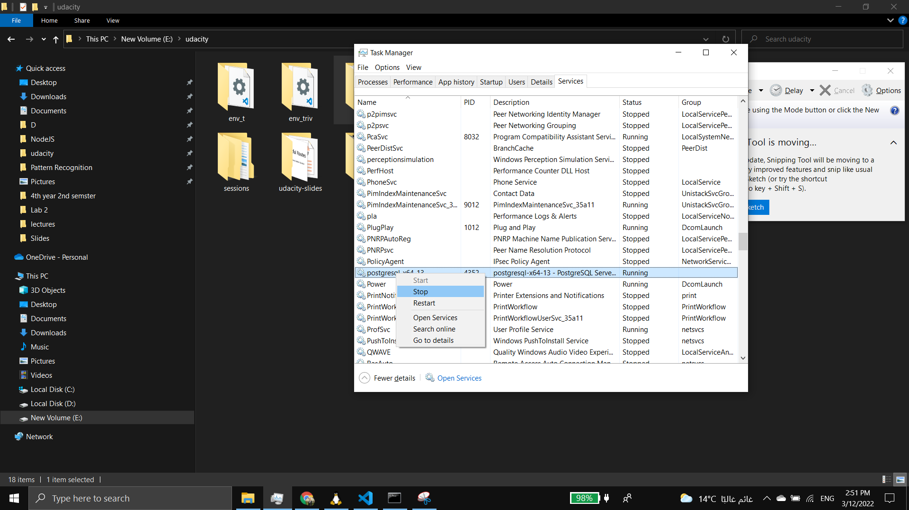

# Note if you're using wsl

- install postgres on wsl ubuntu [link](https://www.postgresql.org/download/linux/ubuntu/)

```
sudo sh -c 'echo "deb http://apt.postgresql.org/pub/repos/apt $(lsb_release -cs)-pgdg main" > /etc/apt/sources.list.d/pgdg.list'
wget --quiet -O - https://www.postgresql.org/media/keys/ACCC4CF8.asc | sudo apt-key add -
sudo apt-get update
sudo apt-get -y install postgresql
```

- if you have postgres on windows stop the service
  
- in wsl run the following command `sudo service postgresql restart`

# create a virtual env

- run `pythom3 -m ven env`
- activate env `source ./env/bin/activate`
- run `pip install -r requirements.txt`

# How to run the project (linux or wsl)

- run `sudo apt install dos2unix`
- run `sudo dos2unix ./setup.sh` this [issue](https://stackoverflow.com/questions/39527571/are-shell-scripts-sensitive-to-encoding-and-line-endings)
- run the following command `chmod +x ./setup.sh`
- run the following command `./setup.sh`
- run `flask run --reload`

# setup database

# testing

- `source ./setup.sh`
- `python3 ./test_app.py`

# Heroku

- Assuming you have already committed all your local edits.
  `git push heroku master`
- to access the bash `heroku run bash`

# Common Issues

- if you can't connect to psql on WSL2
  `sudo /etc/init.d/postgresql start`

# Access the local postgres database

- run `sudo su postgres`
- run `psql`

# Notes

- to view a file in terminal while showing end of line characters `cat -v setup.sh`

# documentation

# Greeting-backend

this is the repository for the example Greeting project

included in the repo the tokens for the different 2 users you will find them in the test_app.py

included also the a postman collection where you can use to interact with the app hosted on heroku

to access the login page you head to this [login](https://herfy.us.auth0.com/authorize?audience=casting-api&response_type=token&client_id=IxV8rY0a41tknH4FDyodNI0wWxpFOoN6&redirect_uri=http://127.0.0.1:5000) page

## authentication

all tokens are fresh you can use them to interact with api

## endpoints

GET "/greetings"

- Fetches an json that contains an array of greetings
- Request Arguments: None
- Query Arguments:
  -page = the page number
  -limit = number of items per page
- Request Body: None
- Returns:
  - an array of greetings as show in the example response
  - status: 200
- Example Response:

```json

{
    "limit": 10,
    "greetings": [
        {

            "greeting": "bonjour",
            "lang": "french"

        }
        ...
    ],
    "next": null,
    "page": 1,
    "prev": null,
    "total": 6
}
```
